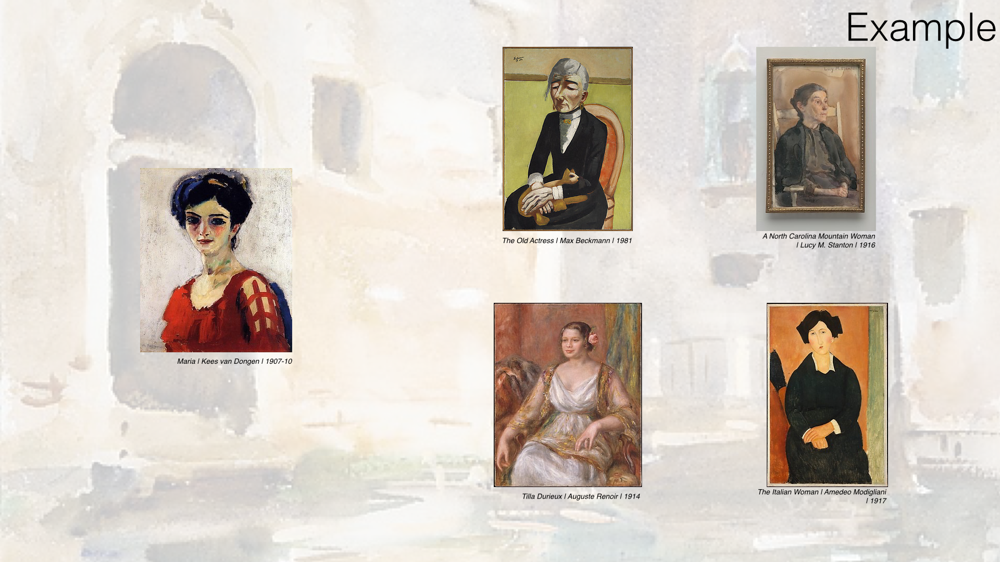
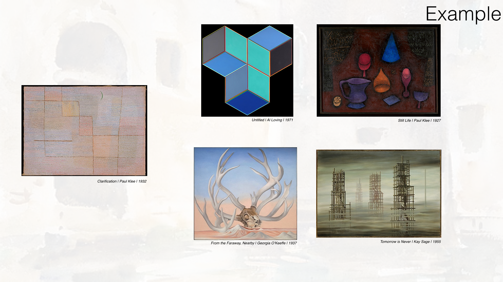
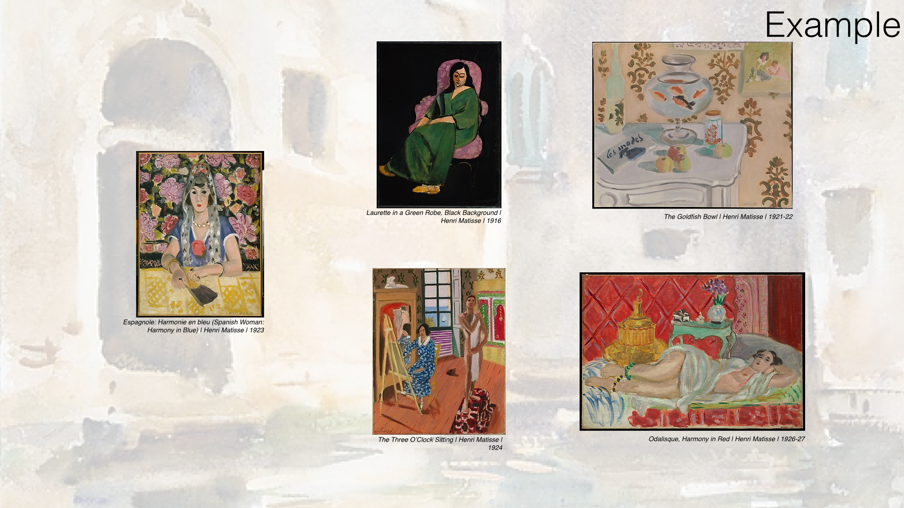

# painting_recommender_for_Met
Recommender system for visitors to use during trips to the Met Art Museum

There are over 2 million pieces of art within The Metropolitan Museum of Art. Navigating through such a large art collection can easily overwhelm any museum goer. Therefore, I’ve created a recommender system which will suggest pieces of art visitors might enjoy. This system will enable visitors to focus on works of art they find attractive. It is a product that enhances the visitor experience. 

This recommender system is easy to use. Once a visitor provides a piece of art s/he enjoys, the recommender will suggest four other museum pieces s/he may enjoy.

Data from [The Met’s Open Access collection](https://www.metmuseum.org/art/collection/search#!?q=&perPage=20&sortBy=Relevance&sortOrder=asc&offset=0&pageSize=0) was obtained to create the recommendation system. The data collected focus on paintings within the collection since 1900. Upon exploring the data, I decided to create a recommender system built on the premise that painting descriptions can be used to determine similar paintings. In other words, the text associated with each painting is used to build a recommender for the paintings themselves.

**DATA**  
For each painting within The Met’s collection created in 1900 and after, I collected both text and image data. I collected an image of the painting and text information on the artist, date, medium, accession #, and painting description. While a web scraping of The Met’s collection yielded 3800 observations, only 1106 had the painting description. This description is essential for the created recommender system. Details on the web scraping can be found in web scraping.ipynb and webscraping2.ipynb.

**RECOMMENDER SYSTEM**  
As previously stated, the recommender system is built on the premise that painting descriptions can be used to suggest similar paintings. Therefore, an unsupervised model using NLP serves as the basis for this system. The system is comprised of several steps. The first is pre-processing of the painting descriptions. This includes lemmatization on the words within each painting description along with the removal of punctuation. Next, a term weighting is calculated for each of the words within a given painting description. This is achieved by application of the TfidfVectorizer, where words with more frequency are weighted less and words with less frequency are weighted more. The creation and application of a Non-Negative Matrix Factorization results in a topic breakdown of each painting description. The higher the value, the stronger the association between a painting and said topic. This matrix, consisting of individual vectors, wherein each vector represents the topic breakdown of a given painting description, is key. When a user selects a given painting for ingestion to the recommendation system, a cosine similarity is performed. This compares the topic breakdown of the description of the selected painting to that of all other painting descriptions within the system. The top four similar topic breakdowns within a given topic description are recommended to the user. Details on the recommender system can be found in classification on blurbs.ipynb.

In the future, I would like to incorporate user feedback into the model to refine the recommender system.

**EXAMPLES**  
Below are a few examples so you can gauge how well the recommender system performs.  

 { width: 200px; }

----
This repo contains:  
 **Code**
 * web scraping.ipynbXX
 * webscraping2.ipynbXX
 * classification on blurbs.ipynbXX
 
 **Data**. 
 * blurbsComplete.pkl
 * jpg2.pkl
 * sites2.pkl
 
 **Slide Deck**. 
 ChristineChen_presentation3.pdf
 
